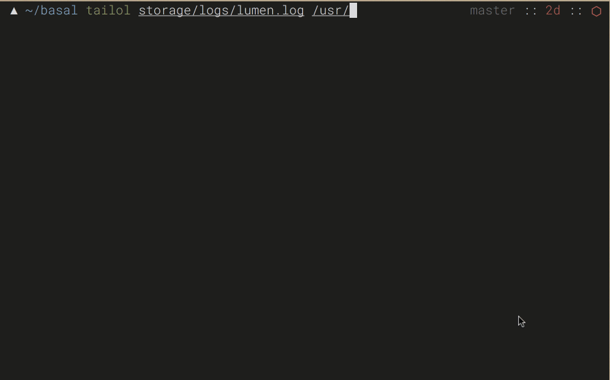

tailol
========
tail multiple files like a boss



> *Hint* early development

###  usage
```
 tailol file1 file2 file3
```
### keyboard shortcuts 

* `TAB` key cycles each log window
* `UP` and `DOWN` arrow keys highlight each line
* `LEFT` and `RIGHT` arrow keys scroll lines that are too long
* `$` and `^` will take you immediately to the end and begining of a line
* `SPACEBAR` jumps 10 characters to the right of a line that is too long 

### installation

```
npm install -g tailol
```
